class: middle, center, title-slide

# Deep Learning

A bottom-up introduction to deep neural networks (Part 3)

  
Prof. Gilles Louppe 
[g.louppe@uliege.be](g.louppe@uliege.be)

---

# Outline

Goal: Learn models of the data itself.

- Generative models
- Variational inference
- Variational auto-encoders
- Generative adversarial networks

---

class: middle

# Generative models

.italic[Slides adapted from "[Tutorial on Deep Generative Models](http://auai.org/uai2017/media/tutorials/shakir.pdf)" 
        (Shakir Mohamed and Danilo Rezende, UAI 2017).]

---

# Generative models

A generative model is a probabilistic model $p$ that can be used as **a simulator of the data**.
Its purpose is to generate synthetic but realistic high-dimension data
$$\mathbf{x} \sim p(\mathbf{x};\theta),$$
that is as close as possible from the true but unknown data distribution $p\_r(\mathbf{x})$.

Goals:
- Learn $p(\mathbf{x};\theta)$ (i.e., go beyond estimating $p(y|\mathbf{x})$).
- Understand and imagine how the world evolves.
- Recognize objects in the world and their factors of variation.
- Establish concepts for reasoning and decision making.

---

class: middle

.center[
.width-100[]
]
.center[Generative models have a role in many important problems]

---

# Drug design and response prediction

Generative models for proposing candidate molecules and for improving prediction through semi-supervised learning.

.center[
.width-100[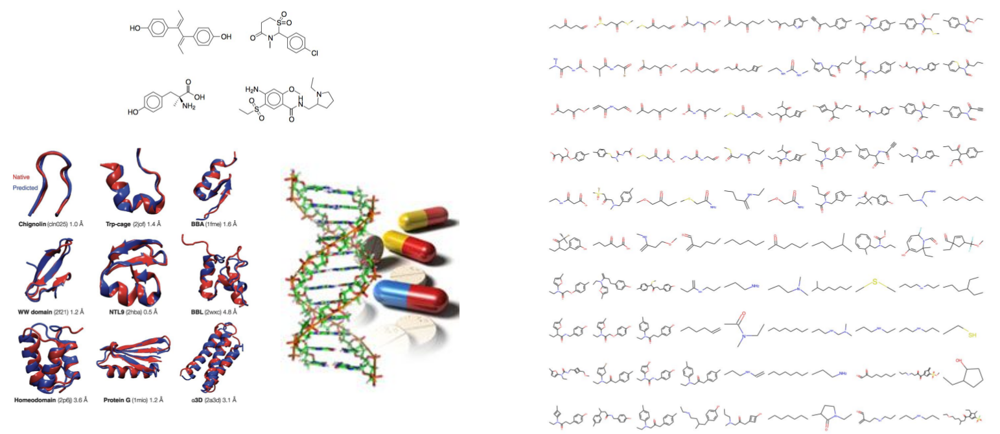]

(Gomez-Bombarelli et al, 2016)
]

---

# Locating celestial bodies

Generative models for applications in astronomy and high-energy physics.

.center[
.width-100[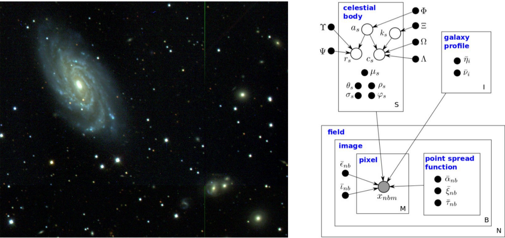]

(Regier et al, 2015)
]

---

# Image super-resolution

Photo-realistic single image super-resolution.

.center[
.width-100[]

(Ledig et al, 2016)
]

---

# Text-to-speech synthesis

Generating audio conditioned on text.

.center[
.width-100[]

(Oord et al, 2016)
]

---

# Image and content generation

Generating images and video content.

.center[
.width-100[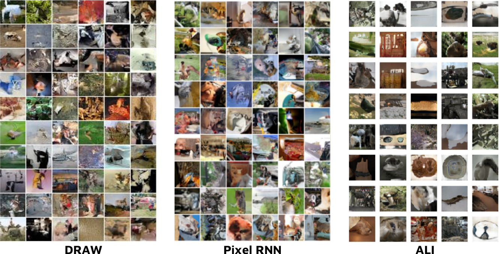]

(Gregor et al, 2015; Oord et al, 2016; Dumoulin et al, 2016)
]

---

# Communication and compression

Hierarchical compression of images and other data.

.center[
.width-100[]

(Gregor et al, 2016)
]

---

# One-shot generalization

Rapid generalization of novel concepts.

.center[
.width-100[]

(Gregor et al, 2016)
]

---

# Visual concept learning

Understanding the factors of variation and invariances.

.center[
.width-100[]

(Higgins et al, 2017)
]

---

# Future simulation

Simulate future trajectories of environments based on actions for planning.

.center[
.width-40[] .width-40[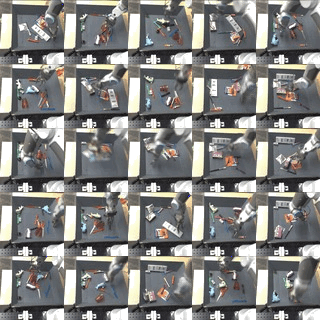]

(Finn et al, 2016)
]

---

# Scene understanding

Understanding the components of scenes and their interactions.

.center[
.width-100[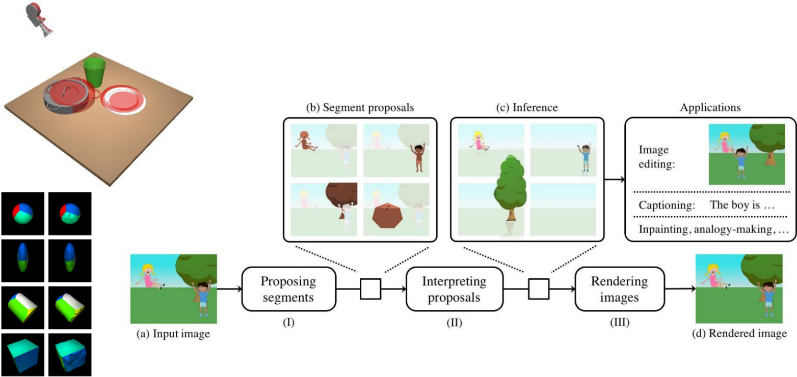]

(Wu et al, 2017)
]

---

class: middle

# Variational inference

---

# Latent variable model

.center.width-10[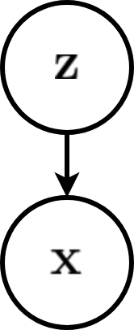]

Consider for now a **prescribed latent variable model** that relates a set of observable variables $\mathbf{x} \in \mathcal{X}$ to a set of unobserved variables $\mathbf{z} \in \mathcal{Z}$.

This model is given and motivated by domain knowledge assumptions.

Examples:
- Linear discriminant analysis (see previous lecture)
- Bayesian networks
- Hidden Markov models
- Probabilistic programs

???

R: improve this

---

class: middle

The probabilistic model defines a joint probability distribution $p(\mathbf{x}, \mathbf{z})$, which decomposes as
$$p(\mathbf{x}, \mathbf{z}) = p(\mathbf{x}|\mathbf{z}) p(\mathbf{z}).$$
If we interpret $\mathbf{z}$ as causal factors for the high-dimension representations $\mathbf{x}$, then
sampling from $p(\mathbf{x}|\mathbf{z})$ can be interpreted as **a stochastic generating process** from $\mathcal{Z}$ to $\mathcal{X}$.

For a given model $p(\mathbf{x}, \mathbf{z})$, inference consists in computing the posterior
$$p(\mathbf{z}|\mathbf{x}) = \frac{p(\mathbf{x}|\mathbf{z}) p(\mathbf{z})}{p(\mathbf{x})}.$$

For most interesting cases, this is usually intractable since it requires evaluating the evidence
$$p(\mathbf{x}) = \int p(\mathbf{x}|\mathbf{z})p(\mathbf{z}) d\mathbf{z}.$$

---

class: middle

.center.width-70[]

.footnote[Credits: [Francois Fleuret, EE559 Deep Learning, EPFL, 2018.](https://documents.epfl.ch/users/f/fl/fleuret/www/dlc/dlc-slides-9-autoencoders.pdf)]

---

# Variational inference

**Variational inference** turns posterior inference into an optimization problem.

Consider a family of distributions $q(\mathbf{z}|\mathbf{x}; \nu)$ that approximate the posterior $p(\mathbf{z}|\mathbf{x})$, where the
variational parameters $\nu$ index the family of distributions.

The parameters $\nu$ are fit to minimize the KL divergence between $p(\mathbf{z}|\mathbf{x})$ and the approximation $q(\mathbf{z}|\mathbf{x};\nu)$:
$$\begin{aligned}
KL(q\(\mathbf{z}|\mathbf{x};\nu) || p(\mathbf{z}|\mathbf{x})) &= \mathbb{E}\_{q(\mathbf{z}|\mathbf{x};\nu)}\left[\log \frac{q(\mathbf{z}|\mathbf{x} ; \nu)}{p(\mathbf{z}|\mathbf{x})}\right] \\\\
&= \mathbb{E}\_{q(\mathbf{z}|\mathbf{x};\nu)}\left[ \log q(\mathbf{z}|\mathbf{x};\nu) - \log p(\mathbf{x},\mathbf{z}) \right] + \log p(\mathbf{x})
\end{aligned}$$
For the same reason as before, the KL divergence cannot be directly minimized because
of the $\log p(\mathbf{x})$ term.

---

class: middle

However, we can write
$$
\log p(\mathbf{x}) = \underbrace{\mathbb{E}\_{q(\mathbf{z}|\mathbf{x};\nu)}\left[ \log p(\mathbf{x},\mathbf{z}) - \log q(\mathbf{z}|\mathbf{x};\nu) \right]}\_{\text{ELBO}(\mathbf{x};\nu)} + KL(q(\mathbf{z}|\mathbf{x};\nu) || p(\mathbf{z}|\mathbf{x})),
$$
where $\text{ELBO}(\mathbf{x};\nu)$ is called the **evidence lower bound objective**.

Since $\log p(\mathbf{x})$ does not depend on $\nu$, it can be considered as a constant, and minimizing the KL divergence is equivalent to maximizing the evidence lower bound, while being computationally tractable.

Finally, given a dataset $\mathbf{d} = \\\{\mathbf{x}\_i|i=1, ..., N\\\}$, the final objective is the sum $\sum\_{\\\{\mathbf{x}\_i \in \mathbf{d}\\\}} \text{ELBO}(\mathbf{x}\_i;\nu)$.

---

class: middle

Remark that
$$\begin{aligned}
\text{ELBO}(\mathbf{x};\nu) &= \mathbb{E}\_{q(\mathbf{z};|\mathbf{x}\nu)}\left[ \log p(\mathbf{x},\mathbf{z}) - \log q(\mathbf{z}|\mathbf{x};\nu) \right] \\\\
&= \mathbb{E}\_{q(\mathbf{z}|\mathbf{x};\nu)}\left[ \log p(\mathbf{x}|\mathbf{z}) p(\mathbf{z}) - \log q(\mathbf{z}|\mathbf{x};\nu) \right] \\\\
&= \mathbb{E}\_{q(\mathbf{z}|\mathbf{x};\nu)}\left[ \log p(\mathbf{x}|\mathbf{z})\right] - KL(q(\mathbf{z}|\mathbf{x};\nu) || p(\mathbf{z}))
\end{aligned}$$
Therefore, maximizing the ELBO:
- encourages distributions to place their mass on configurations of latent variables that explain the observed data (first term);
- encourages distributions close to the prior (second term).

---

class: middle, center

.width-100[]

Variational inference

---

class: middle

How do we optimize the parameters $\nu$? We want

$$\begin{aligned}
\nu^{\*} &= \arg \max\_\nu \text{ELBO}(\mathbf{x};\nu) \\\\
&= \arg \max\_\nu \mathbb{E}\_{q(\mathbf{z}|\mathbf{x};\nu)}\left[ \log p(\mathbf{x},\mathbf{z}) - \log q(\mathbf{z}|\mathbf{x};\nu) \right]
\end{aligned}$$

We can proceed by gradient ascent, provided we can evaluate $\nabla\_\nu \text{ELBO}(\mathbf{x};\nu)$.

In general,
this gradient is difficult to compute because the expectation is unknown and the parameters $\nu$,
with respect to which we compute the gradient, are of the distribution $q(\mathbf{z}|\mathbf{x};\nu)$ we integrate over.

Solutions:
- Score function estimators:
$$\nabla\_\nu \text{ELBO}(\mathbf{x};\nu) = \mathbb{E}\_{q(\mathbf{z}|\mathbf{x};\nu)} \left[ \nabla\_\nu \log q(\mathbf{z}|\mathbf{x};\nu) \left( \log p(\mathbf{x},\mathbf{z}) - \log q(\mathbf{z}|\mathbf{x};\nu) \right)\right]$$
- Elliptical standardization (Kucukelbir et al, 2016).

---

class: middle

# Variational auto-encoders

---

# Variational auto-encoders

So far we assumed a prescribed probabilistic model motivated by domain knowledge.
We will now directly learn a stochastic generating process with a neural network.

A variational auto-encoder is a deep latent variable model where:
- The likelihood $p(\mathbf{x}|\mathbf{z};\theta)$ is parameterized with a **generative network** $\text{NN}\_\theta$
(or decoder) that takes as input $\mathbf{z}$ and outputs parameters $\phi = \text{NN}\_\theta(\mathbf{z})$ to the data distribution. E.g.,
$$\begin{aligned}
\mu, \sigma &= \text{NN}\_\theta(\mathbf{z}) \\\\
p(\mathbf{x}|\mathbf{z};\theta) &= \mathcal{N}(\mathbf{x}; \mu, \sigma^2\mathbf{I})
\end{aligned}$$
- The approximate posterior $q(\mathbf{z}|\mathbf{x};\varphi)$ is parameterized
with an **inference network** $\text{NN}\_\varphi$ (or encoder) that takes as input $\mathbf{x}$ and
outputs parameters $\nu = \text{NN}\_\varphi(\mathbf{x})$ to the approximate posterior. E.g.,
$$\begin{aligned}
\mu, \sigma &= \text{NN}\_\varphi(\mathbf{x}) \\\\
q(\mathbf{z}|\mathbf{x};\varphi) &= \mathcal{N}(\mathbf{z}; \mu, \sigma^2\mathbf{I})
\end{aligned}$$

---

class: middle

.center.width-70[]

.footnote[Credits: [Francois Fleuret, EE559 Deep Learning, EPFL, 2018.](https://documents.epfl.ch/users/f/fl/fleuret/www/dlc/dlc-slides-9-autoencoders.pdf)]

---

class: middle

As before, we can use variational inference, but to jointly optimize the generative and the inference networks parameters $\theta$ and $\varphi$.

We want:
$$\begin{aligned}
\theta^{\*}, \varphi^{\*} &= \arg \max\_{\theta,\varphi} \text{ELBO}(\mathbf{x};\theta,\varphi) \\\\
&= \arg \max\_{\theta,\varphi} \mathbb{E}\_{q(\mathbf{z}|\mathbf{x};\varphi)}\left[ \log p(\mathbf{x},\mathbf{z};\theta) - \log q(\mathbf{z}|\mathbf{x};\varphi)\right] \\\\
&= \arg \max\_{\theta,\varphi} \mathbb{E}\_{q(\mathbf{z}|\mathbf{x};\varphi)}\left[ \log p(\mathbf{x}|\mathbf{z};\theta)\right] - KL(q(\mathbf{z}|\mathbf{x};\varphi) || p(\mathbf{z}))
\end{aligned}$$

- Given some generative network $\theta$, we want to put the mass of the latent variables, by adjusting $\varphi$, such that they explain the observed data, while remaining close to the prior.
- Given some inference network $\varphi$, we want to put the mass of the observed variables, by adjusting $\theta$, such that
they are well explained by the latent variables.

---

class: middle

Unbiased gradients of the ELBO with respect to the generative model parameters $\theta$ are simple to obtain:
$$\begin{aligned}
\nabla\_\theta \text{ELBO}(\mathbf{x};\theta,\varphi) &= \nabla\_\theta \mathbb{E}\_{q(\mathbf{z}|\mathbf{x};\varphi)}\left[ \log p(\mathbf{x},\mathbf{z};\theta) - \log q(\mathbf{z}|\mathbf{x};\varphi)\right] \\\\
&= \mathbb{E}\_{q(\mathbf{z}|\mathbf{x};\varphi)}\left[ \nabla\_\theta ( \log p(\mathbf{x},\mathbf{z};\theta) - \log q(\mathbf{z}|\mathbf{x};\varphi) ) \right] \\\\
&= \mathbb{E}\_{q(\mathbf{z}|\mathbf{x};\varphi)}\left[ \nabla\_\theta \log p(\mathbf{x},\mathbf{z};\theta) \right],
\end{aligned}$$
which can be estimated with Monte Carlo integration.

However, gradients with respect to the inference model parameters $\varphi$ are
more difficult to obtain:
$$\begin{aligned}
\nabla\_\varphi \text{ELBO}(\mathbf{x};\theta,\varphi) &= \nabla\_\varphi \mathbb{E}\_{q(\mathbf{z}|\mathbf{x};\varphi)}\left[ \log p(\mathbf{x},\mathbf{z};\theta) - \log q(\mathbf{z}|\mathbf{x};\varphi)\right] \\\\
&\neq \mathbb{E}\_{q(\mathbf{z}|\mathbf{x};\varphi)}\left[ \nabla\_\varphi ( \log p(\mathbf{x},\mathbf{z};\theta) - \log q(\mathbf{z}|\mathbf{x};\varphi) ) \right]
\end{aligned}$$

---

class: middle

Let us abbreviate
$$\begin{aligned}
\text{ELBO}(\mathbf{x};\theta,\varphi) &= \mathbb{E}\_{q(\mathbf{z}|\mathbf{x};\varphi)}\left[ \log p(\mathbf{x},\mathbf{z};\theta) - \log q(\mathbf{z}|\mathbf{x};\varphi)\right] \\\\
&= \mathbb{E}\_{q(\mathbf{z}|\mathbf{x};\varphi)}\left[ f(\mathbf{x}, \mathbf{z}; \varphi) \right].
\end{aligned}$$

We have
.center.width-50[]

We cannot backpropagate through the stochastic node $\mathbf{z}$ to compute $\nabla\_\varphi f$.

---

# Reparameterization trick

The **reparameterization trick** consists in re-expressing the variable $\mathbf{z} \sim q(\mathbf{z}|\mathbf{x};\varphi)$ as some differentiable and invertible transformation
of another random variable $\epsilon$, given $\mathbf{x}$ and $\varphi$,
$$\mathbf{z} = g(\varphi, \mathbf{x}, \epsilon),$$
and where the distribution of $\epsilon$ is independent of $\mathbf{x}$ or $\varphi$.

For example, if $q(\mathbf{z}|\mathbf{x};\varphi) = \mathcal{N}(\mathbf{z}; \mu(\mathbf{x};\varphi), \sigma^2(\mathbf{x};\varphi))$, where $\mu(\mathbf{x};\varphi)$ and $\sigma^2(\mathbf{x};\varphi)$
are the outputs of the inference network $NN\_\varphi$, then a common reparameterization is:
$$\begin{aligned}
p(\epsilon) &= \mathcal{N}(\epsilon; \mathbf{0}, \mathbf{I}) \\\\
\mathbf{z} &= \mu(\mathbf{x};\varphi) + \sigma(\mathbf{x};\varphi) \odot \epsilon
\end{aligned}$$

---

class: middle

.center.width-60[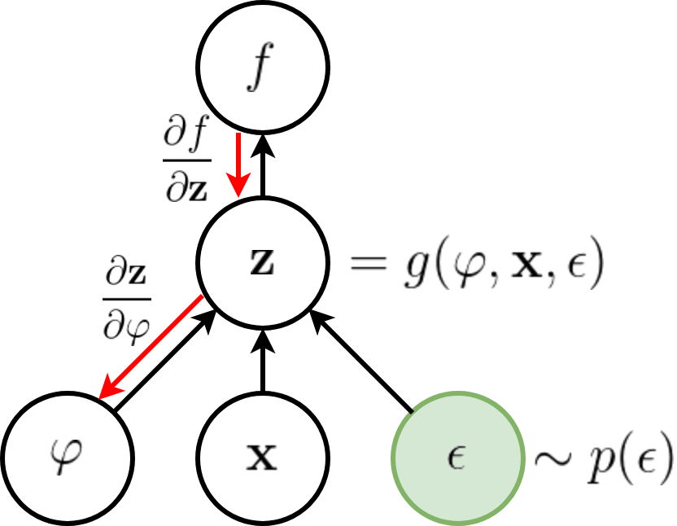]

---

class: middle

Given such a change of variable, the ELBO can be rewritten as:
$$\begin{aligned}
\text{ELBO}(\mathbf{x};\theta,\varphi) &= \mathbb{E}\_{q(\mathbf{z}|\mathbf{x};\varphi)}\left[ f(\mathbf{x}, \mathbf{z}; \varphi) \right]\\\\
&= \mathbb{E}\_{p(\epsilon)} \left[ f(\mathbf{x}, g(\varphi,\mathbf{x},\epsilon); \varphi) \right]
\end{aligned}$$
Therefore,
$$\begin{aligned}
\nabla\_\varphi \text{ELBO}(\mathbf{x};\theta,\varphi) &= \nabla\_\varphi \mathbb{E}\_{p(\epsilon)} \left[  f(\mathbf{x}, g(\varphi,\mathbf{x},\epsilon); \varphi) \right] \\\\
&= \mathbb{E}\_{p(\epsilon)} \left[ \nabla\_\varphi  f(\mathbf{x}, g(\varphi,\mathbf{x},\epsilon); \varphi) \right],
\end{aligned}$$
which we can now estimate with Monte Carlo integration.

The last required ingredient is the evaluation of the likelihood $q(\mathbf{z}|\mathbf{x};\varphi)$ given the change of variable $g$. As long as $g$ is invertible, we have:
$$\log q(\mathbf{z}|\mathbf{x};\varphi) = \log p(\epsilon) - \log \left| \det\left( \frac{\partial \mathbf{z}}{\partial \epsilon} \right) \right|$$

---

# Example

Consider the following setup:
- Generative model:
$$\begin{aligned}
\mathbf{z} &\in \mathbb{R}^J \\\\
p(\mathbf{z}) &= \mathcal{N}(\mathbf{z}; \mathbf{0},\mathbf{I})\\\\
p(\mathbf{x}|\mathbf{z};\theta) &= \mathcal{N}(\mathbf{x};\mu(\mathbf{z};\theta), \sigma^2(\mathbf{z};\theta)\mathbf{I}) \\\\
\mu(\mathbf{z};\theta) &= \mathbf{W}\_2^T\mathbf{h} + \mathbf{b}\_2 \\\\
\log \sigma^2(\mathbf{z};\theta) &= \mathbf{W}\_3^T\mathbf{h} + \mathbf{b}\_3 \\\\
\mathbf{h} &= \text{ReLU}(\mathbf{W}\_1^T \mathbf{z} + \mathbf{b}\_1)\\\\
\theta &= \\\{ \mathbf{W}\_1, \mathbf{b}\_1, \mathbf{W}\_2, \mathbf{b}\_2, \mathbf{W}\_3, \mathbf{b}\_3 \\\}
\end{aligned}$$

---

class: middle

- Inference model:
$$\begin{aligned}
q(\mathbf{z}|\mathbf{x};\varphi) &=  \mathcal{N}(\mathbf{z};\mu(\mathbf{x};\varphi), \sigma^2(\mathbf{x};\varphi)\mathbf{I}) \\\\
p(\epsilon) &= \mathcal{N}(\epsilon; \mathbf{0}, \mathbf{I}) \\\\
\mathbf{z} &= \mu(\mathbf{x};\varphi) + \sigma(\mathbf{x};\varphi) \odot \epsilon \\\\
\mu(\mathbf{x};\varphi) &= \mathbf{W}\_5^T\mathbf{h} + \mathbf{b}\_5 \\\\
\log \sigma^2(\mathbf{x};\varphi) &= \mathbf{W}\_6^T\mathbf{h} + \mathbf{b}\_6 \\\\
\mathbf{h} &= \text{ReLU}(\mathbf{W}\_4^T \mathbf{x} + \mathbf{b}\_4)\\\\
\varphi &= \\\{ \mathbf{W}\_4, \mathbf{b}\_4, \mathbf{W}\_5, \mathbf{b}\_5, \mathbf{W}\_6, \mathbf{b}\_6 \\\}
\end{aligned}$$

Note that there is no restriction on the generative and inference network architectures.
They could as well be arbitrarily complex convolutional networks.

---

class: middle

Plugging everything together, the objective can be expressed as:
$$\begin{aligned}
\text{ELBO}(\mathbf{x};\theta,\varphi) &= \mathbb{E}\_{q(\mathbf{z}|\mathbf{x};\varphi)}\left[ \log p(\mathbf{x},\mathbf{z};\theta) - \log q(\mathbf{z}|\mathbf{x};\varphi)\right] \\\\
&= \mathbb{E}\_{q(\mathbf{z}|\mathbf{x};\varphi)} \left[ \log p(\mathbf{x}|\mathbf{z};\theta) \right] - KL(q(\mathbf{z}|\mathbf{x};\varphi) || p(\mathbf{z})) \\\\
&= \mathbb{E}\_{p(\epsilon)} \left[  \log p(\mathbf{x}|\mathbf{z}=g(\varphi,\mathbf{x},\epsilon);\theta) \right] - KL(q(\mathbf{z}|\mathbf{x};\varphi) || p(\mathbf{z}))
\end{aligned}
$$
where the KL divergence can be expressed  analytically as
$$KL(q(\mathbf{z}|\mathbf{x};\varphi) || p(\mathbf{z})) = \frac{1}{2} \sum\_{j=1}^J \left( 1 + \log(\sigma\_j^2(\mathbf{x};\varphi)) - \mu\_j^2(\mathbf{x};\varphi) - \sigma\_j^2(\mathbf{x};\varphi)\right),$$
which allows to evaluate its derivative without approximation.

---

class: middle

Consider as data $\mathbf{d}$ the MNIST digit dataset:

.center.width-100[]

---

class: middle, center

.width-100[]

(Kingma and Welling, 2013)

---

class: middle

To get an intuition of the learned latent representation, we can pick two samples $\mathbf{x}$ and $\mathbf{x}'$ at random and interpolate samples along the line in the latent space.

.center.width-70[]

.footnote[Credits: [Francois Fleuret, EE559 Deep Learning, EPFL, 2018.](https://documents.epfl.ch/users/f/fl/fleuret/www/dlc/dlc-slides-9-autoencoders.pdf)]

---

class: middle, center

.width-100[]

(Kingma and Welling, 2013)

---

# Further examples

.center[

<iframe width="640" height="480" src="https://www.youtube.com/embed/XNZIN7Jh3Sg?&loop=1&start=0" frameborder="0" volume="0" allowfullscreen></iframe>

Random walks in latent space.

]

---

class: middle

.center.width-80[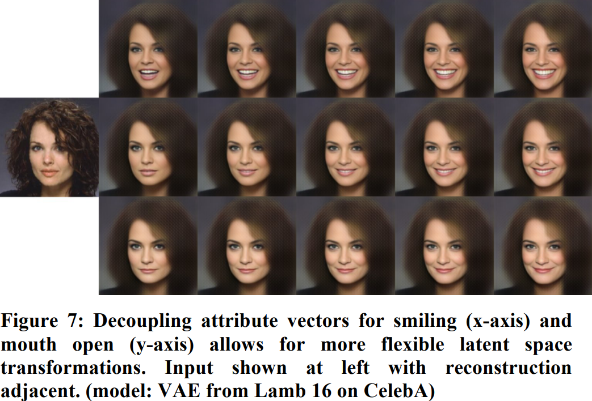]

.center[(White, 2016)]

---

class: middle

.center.width-60[]

.center[(Bowman et al, 2015)]

---

class: middle

.center[

<iframe width="320" height="240" src="https://int8.io/wp-content/uploads/2016/12/output.mp4" frameborder="0" volume="0" allowfullscreen></iframe>

Impersonation by encoding-decoding an unknown face.
]

---

class: middle

.center.width-100[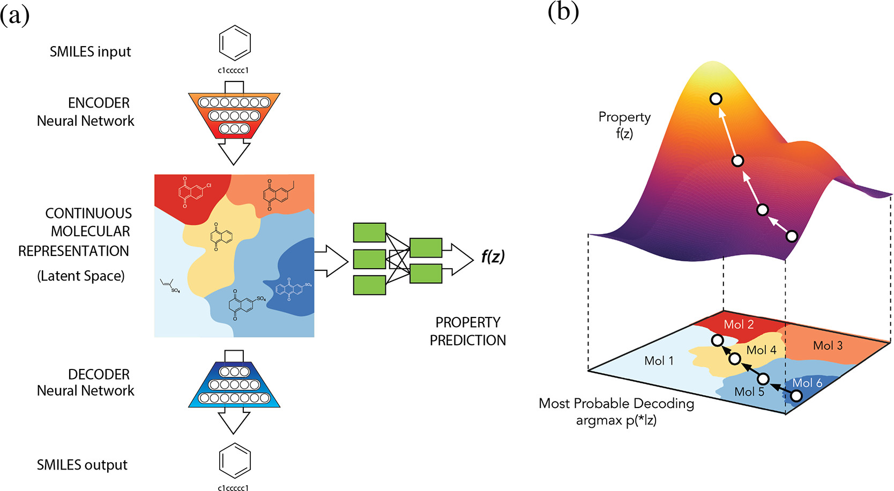]

.center[Design of new molecules with desired chemical properties.  (Gomez-Bombarelli et al, 2016)]

---

class: middle

# Generative adversarial networks

---

class: middle

.center.width-80[]

---

# Generative adversarial networks

The main idea of **generative adversarial networks** (GANs) is to express the task of learning a generative model as a two-player zero-sum game between two networks.

- The first network is a generator  $g(\cdot;\theta) : \mathcal{Z} \to \mathcal{X}$, mapping a latent space equipped with a prior distribution $p(\mathbf{z})$ to the data space, thereby inducing a distribution
$$\mathbf{x} \sim p(\mathbf{x};\theta) \Leftrightarrow \mathbf{z} \sim p(\mathbf{z}), \mathbf{x} = g(\mathbf{z};\theta).$$
- The second network $d(\cdot; \phi) : \mathcal{X} \to [0,1]$ is a classifier trained to distinguish between true samples $\mathbf{x} \sim p\_r(\mathbf{x})$ and generated samples $\mathbf{x} \sim p(\mathbf{x};\theta)$.

The central mechanism will be to use supervised learning to guide the learning of the generative model.

---

class: middle

.center.width-100[]

---

# Game analysis

Consider a generator $g$ fixed at $\theta$. Given a set of observations
$$\mathbf{x}\_i \sim p\_r(\mathbf{x}), i=1, ..., N,$$
we can generate a two-class dataset
$$\mathbf{d} = \\\{ (\mathbf{x}\_1, 1), ..., (\mathbf{x}\_N,1), (g(\mathbf{z}\_1;\theta), 0), ..., (g(\mathbf{z}\_N;\theta), 0)) \\\}.$$

The best classifier $d$ is obtained by minimizing
the cross-entropy
$$\begin{aligned}
\mathcal{L}(\phi) &= -\frac{1}{2N} \left( \sum\_{i=1}^N \left[ \log d(\mathbf{x}\_i;\phi) \right] + \sum\_{i=1}^N\left[ \log (1-d(g(\mathbf{z}\_i;\theta);\phi)) \right] \right) \\\\
&\approx -\frac{1}{2} \left( \mathbb{E}\_{\mathbf{x} \sim p\_r(\mathbf{x})}\left[ \log d(\mathbf{x};\phi) \right] + \mathbb{E}\_{\mathbf{z} \sim p(\mathbf{z})}\left[ \log (1-d(g(\mathbf{z};\theta);\phi)) \right] \right)
\end{aligned}$$
with respect to $\phi$.

---

class: middle

Following Goodfellow et al (2014), let us define the **value function**
$$V(\phi, \theta) =  \mathbb{E}\_{\mathbf{x} \sim p\_r(\mathbf{x})}\left[ \log d(\mathbf{x};\phi) \right] + \mathbb{E}\_{\mathbf{z} \sim p(\mathbf{z})}\left[ \log (1-d(g(\mathbf{z};\theta);\phi)) \right].$$

Then,
- $V(\phi, \theta)$ is high if $d$ is good at recognizing true from generated samples.

- If $d$ is the best classifier given $g$, and if $V$ is high, then this implies that
the generator is bad at reproducing the data distribution.

- Conversely, $g$ will be a good generative model if $V$ is low when $d$ is a perfect opponent.

Therefore, the ultimate goal is
$$\theta^\* = \arg \min\_\theta \max\_\phi V(\phi, \theta).$$

---

class: middle

For a generator $g$ fixed at $\theta$, the classifier $d$ with parameters $\phi^\*\_\theta$ is optimal if and only if
$$\forall \mathbf{x}, d(\mathbf{x};\phi^\*\_\theta) = \frac{p\_r(\mathbf{x})}{p(\mathbf{x};\theta) + p\_r(\mathbf{x})}.$$

Therefore,
$$\begin{aligned}
&\min\_\theta \max\_\phi V(\phi, \theta) = \min\_\theta V(\phi^\*\_\theta, \theta) \\\\
&= \min\_\theta \mathbb{E}\_{\mathbf{x} \sim p\_r(\mathbf{x})}\left[ \log \frac{p\_r(\mathbf{x})}{p(\mathbf{x};\theta) + p\_r(\mathbf{x})} \right] + \mathbb{E}\_{\mathbf{x} \sim p(\mathbf{x};\theta)}\left[ \log \frac{p(\mathbf{x};\theta)}{p(\mathbf{x};\theta) + p\_r(\mathbf{x})} \right] \\\\
&= \min\_\theta \text{KL}\left(p\_r(\mathbf{x}) || \frac{p\_r(\mathbf{x}) + p(\mathbf{x};\theta)}{2}\right) \\\\
&\quad\quad\quad+ \text{KL}\left(p(\mathbf{x};\theta) || \frac{p\_r(\mathbf{x}) + p(\mathbf{x};\theta)}{2}\right) -\log 4\\\\
&= \min\_\theta 2\, \text{JSD}(p\_r(\mathbf{x}) || p(\mathbf{x};\theta)) - \log 4
\end{aligned}$$
where $\text{JSD}$ is the Jensen-Shannon divergence.

---

class: middle

In summary, solving the minimax problem
$$\theta^\* = \arg \min\_\theta \max\_\phi V(\phi, \theta)$$
is equivalent to  
$$\theta^\* = \arg \min\_\theta \text{JSD}(p\_r(\mathbf{x}) || p(\mathbf{x};\theta)).$$

Since $\text{JSD}(p\_r(\mathbf{x}) || p(\mathbf{x};\theta))$ is minimum if and only if
$p\_r(\mathbf{x}) = p(\mathbf{x};\theta)$, this proves that the minimax solution
corresponds to a generative model that perfectly reproduces the true data distribution.

---

# Learning process

  

.center.width-100[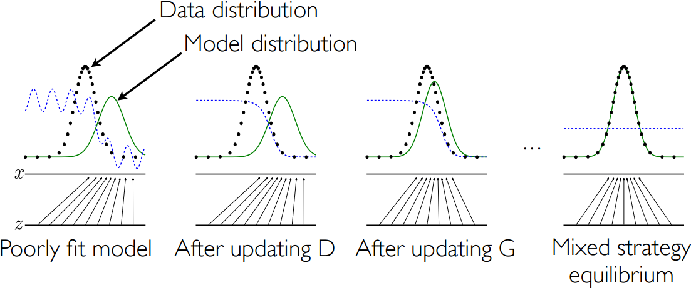]

.center[(Goodfellow et al, 2014)]

---

# Alternating SGD

In practice, the minimax solution is approximated using **alternating stochastic gradient descent**, for
which gradients
$$\begin{aligned}
\nabla\_\phi V(\phi, \theta) &= \mathbb{E}\_{\mathbf{x} \sim p\_r(\mathbf{x})}\left[ \nabla\_\phi \log d(\mathbf{x};\phi) \right] + \mathbb{E}\_{\mathbf{z} \sim p(\mathbf{z})}\left[  \nabla\_\phi \log (1-d(g(\mathbf{z};\theta);\phi)) \right], \\\\
\nabla\_\theta V(\phi, \theta) &= \mathbb{E}\_{\mathbf{z} \sim p(\mathbf{z})}\left[  \nabla\_\theta \log (1-d(g(\mathbf{z};\theta);\phi)) \right],
\end{aligned}$$
are approximated using Monte Carlo integration.

These noisy estimates can in turn be used alternatively
to do gradient descent on $\theta$ and gradient ascent on $\phi$.

- For one step on $\theta$, we can optionally take $k$ steps on $\phi$, since we need the classifier to remain near optimal.
- Note that to compute $\nabla\_\theta V(\phi, \theta)$, it is necessary to backprop all the way through $d$ before computing the partial derivatives with respect to $g$'s internals.

---

class: middle

.center.width-100[]

.center[(Goodfellow et al, 2014)]

---

class: middle

.center.width-80[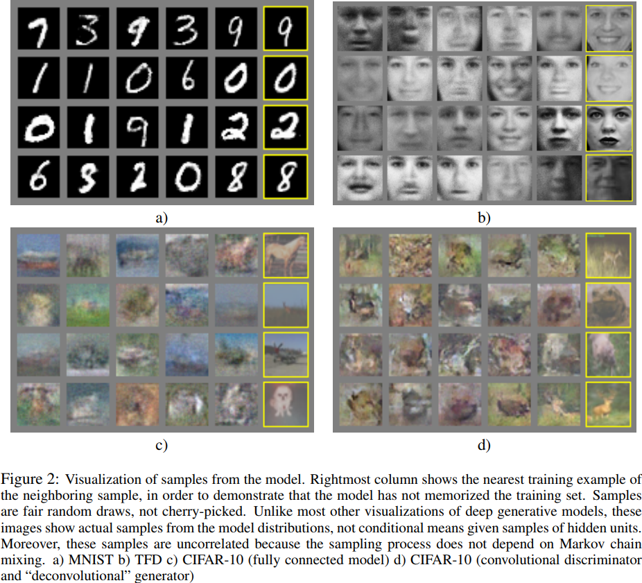]

.center[(Goodfellow et al, 2014)]

---

# Open problems

Training a standard GAN often results in **pathological behaviors**:

- Oscillations without convergence: contrary to standard loss minimization,
  alternating stochastic gradient descent has no guarantee of convergence.
- Vanishing gradient: when the classifier $d$ is too good, the value function saturates
  and we end up with no gradient to update the generator (more on this later).
- Mode collapse: the generator $g$ models very well a small sub-population,
  concentrating on a few modes of the data distribution.

Performance is also difficult to assess in practice.

.center.width-100[]

.center[Mode collapse (Metz et al, 2016)]

---

# Progressive growing of GANs

  

.center.width-100[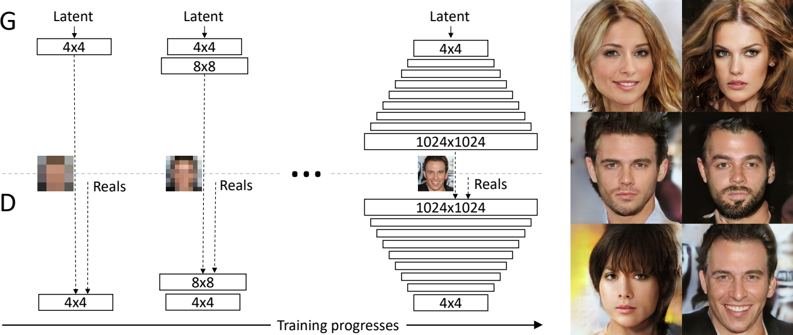]

.center[(Karras et al, 2017)]

---

class: middle, black-slide

.center[

<iframe width="640" height="480" src="https://www.youtube.com/embed/XOxxPcy5Gr4?&loop=1&start=0" frameborder="0" volume="0" allowfullscreen></iframe>

.center[(Karras et al, 2017)]

]

---

class: middle, black-slide

.center[

<iframe width="640" height="480" src="https://www.youtube.com/embed/kSLJriaOumA?&loop=1&start=0" frameborder="0" volume="0" allowfullscreen></iframe>

.center[(Karras et al, 2018)]

]

---

# Cabinet of curiosities

While state-of-the-art results are impressive, a close inspection of the fake samples distribution $p(\mathbf{x};\theta)$ often reveals fundamental issues highlighting architectural limitations.

These issues remain an open research problem.

.center.width-80[]
.center[Cherry-picks (Goodfellow, 2016)]

---

class: middle

.center.width-100[]

.center[Problems with counting (Goodfellow, 2016)]

---

class: middle

.center.width-100[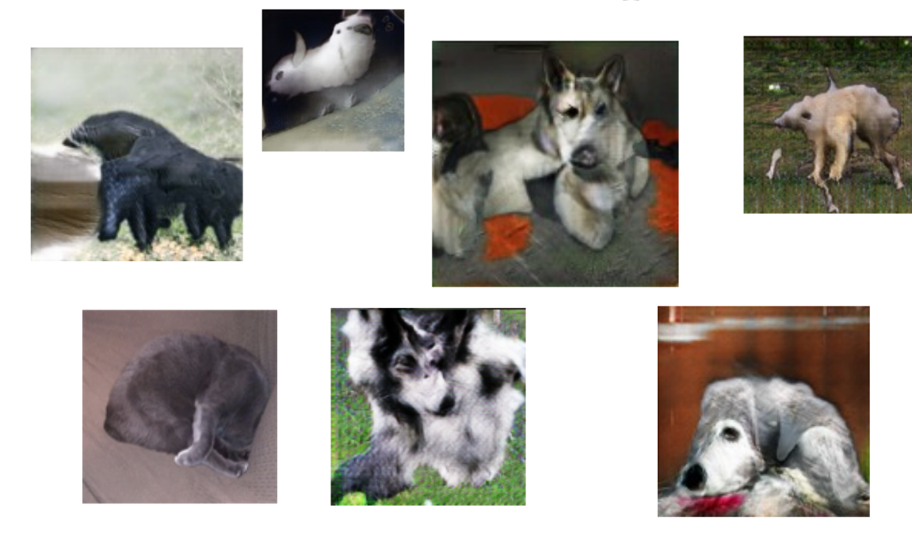]

.center[Problems with perspective (Goodfellow, 2016)]

---

class: middle

.center.width-100[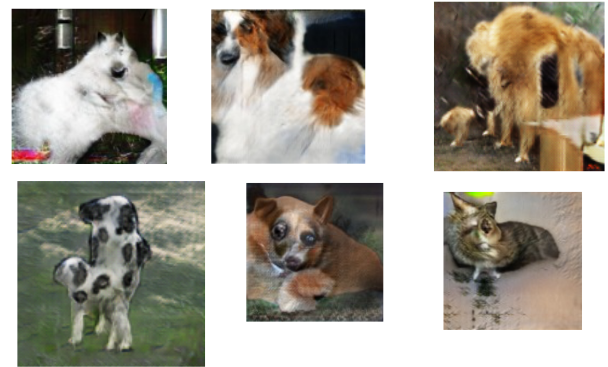]

.center[Problems with global structures (Goodfellow, 2016)]

---

class: center, middle

# Wasserstein GAN

---

# Vanishing gradients

For most non-toy data distributions, the fake samples $\mathbf{x} \sim p(\mathbf{x};\theta)$
may be so bad initially that the response of $d$ saturates.
At the limit, when $d$ is perfect given the current generator $g$,
$$\begin{aligned}
d(\mathbf{x};\phi) &= 1, \forall \mathbf{x} \sim p\_r(\mathbf{x}), \\\\
d(\mathbf{x};\phi) &= 0, \forall \mathbf{x} \sim p(\mathbf{x};\theta).
\end{aligned}$$
Therefore,
$$V(\phi, \theta) =  \mathbb{E}\_{\mathbf{x} \sim p\_r(\mathbf{x})}\left[ \log d(\mathbf{x};\phi) \right] + \mathbb{E}\_{\mathbf{z} \sim p(\mathbf{z})}\left[ \log (1-d(g(\mathbf{z};\theta);\phi)) \right] = 0$$
and $\nabla\_\theta V(\phi,\theta) = 0$, thereby halting gradient descent.

Dilemma:
- If $d$ is bad, then $g$ does not have accurate feedback and the loss function cannot represent the reality.
- If $d$ is too good, the gradients drop to 0, thereby slowing down or even halting the optimization.

---

# Jensen-Shannon divergence

For any two distributions $p$ and $q$,
$$0 \leq JSD(p||q) \leq \log 2,$$
where
- $JSD(p||q)=0$ if and only if $p=q$,
- $JSD(p||q)=\log 2$ if and only if $p$ and $q$ have disjoint supports.

.center[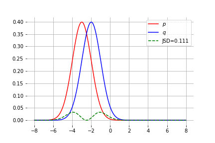]

---

class: middle

Notice how the Jensen-Shannon divergence poorly accounts for the metric structure of the space.

Intuitively, instead of comparing distributions "vertically", we would like to compare them "horizontally".

.center[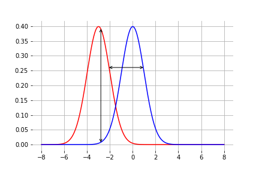]

---

# Wasserstein distance

An alternative choice is the **Earth mover's distance**, which intuitively
corresponds to the minimum mass displacement to transform one distribution into
the other.

.center.width-100[]

- $p = \frac{1}{4}\mathbf{1}\_{[1,2]} + \frac{1}{4}\mathbf{1}\_{[3,4]} + \frac{1}{2}\mathbf{1}\_{[9,10]}$
- $q = \mathbf{1}\_{[5,7]}$

Then,
$$\text{W}\_1(p,q) = 4\times\frac{1}{4} + 2\times\frac{1}{4} + 3\times\frac{1}{2}=3$$

.footnote[Credits: [EE559 Deep Learning](https://documents.epfl.ch/users/f/fl/fleuret/www/dlc/dlc-slides-10-gans.pdf) (Fleuret, 2018)]

---

class: middle

The Earth mover's distance is also known as the Wasserstein-1 distance and is defined as:
$$\text{W}\_1(p, q) = \inf\_{\gamma \in \Pi(p,q)} \mathbb{E}\_{(x,y)\sim \gamma} \left[||x-y||\right]$$
where:
- $\Pi(p,q)$ denotes the set of all joint distributions $\gamma(x,y)$ whose marginals are respectively $p$ and $q$;
- $\gamma(x,y)$ indicates how much mass must be transported from $x$ to $y$ in order to transform the distribution $p$ into $q$.
- $||\cdot||$ is the L1 norm and $||x-y||$ represents the cost of moving a unit of mass from $x$ to $y$.

---

class: middle

.center[]

---

class: middle

Notice how the $\text{W}\_1$ distance does not saturate. Instead, it
 increases monotonically with the distance between modes:

.center[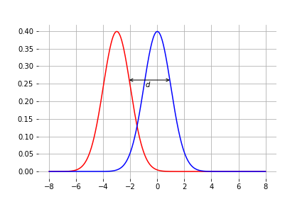]

$$\text{W}\_1(p,q)=d$$

For any two distributions $p$ and $q$,
- $W\_1(p,q) \in \mathbb{R}^+$,
- $W\_1(p,q)=0$ if and only if $p=q$.

---

# Wasserstein GAN

Given the attractive properties of the Wasserstein-1 distance, Arjovsky et al (2017) propose
to learn a generative model by solving instead:
$$\theta^\* = \arg \min\_\theta \text{W}\_1(p\_r(\mathbf{x})||p(\mathbf{x};\theta))$$
Unfortunately, the definition of $\text{W}\_1$ does not provide with an operational way of estimating it because of the intractable $\inf$.

On the other hand, the Kantorovich-Rubinstein duality tells us that
$$\text{W}\_1(p\_r(\mathbf{x})||p(\mathbf{x};\theta)) = \sup\_{||f||\_L \leq 1} \mathbb{E}\_{\mathbf{x} \sim p\_r(\mathbf{x})}\left[ f(\mathbf{x}) \right] - \mathbb{E}\_{\mathbf{x} \sim p(\mathbf{x};\theta)} \left[f(\mathbf{x})\right]$$
where the supremum is over all the 1-Lipschitz functions $f:\mathcal{X} \to \mathbb{R}$. That is, functions $f$ such that
$$||f||\_L = \max\_{\mathbf{x},\mathbf{x}'} \frac{||f(\mathbf{x}) - f(\mathbf{x}')||}{||\mathbf{x} - \mathbf{x}'||} \leq 1.$$

---

class: middle

.center.width-80[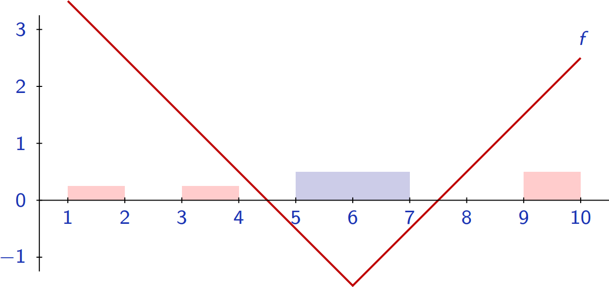]

For $p = \frac{1}{4}\mathbf{1}\_{[1,2]} + \frac{1}{4}\mathbf{1}\_{[3,4]} + \frac{1}{2}\mathbf{1}\_{[9,10]}$
and $q = \mathbf{1}\_{[5,7]}$,
$$\begin{aligned}
\text{W}\_1(p,q) &= 4\times\frac{1}{4} + 2\times\frac{1}{4} + 3\times\frac{1}{2}=3 \\\\
&= \underbrace{\left(3\times \frac{1}{4} + 1\times\frac{1}{4}+2\times\frac{1}{2}\right)}\_{\mathbb{E}\_{\mathbf{x} \sim p\_r(\mathbf{x})}\left[ f(\mathbf{x}) \right]} - \underbrace{\left(-1\times\frac{1}{2}-1\times\frac{1}{2}\right)}\_{\mathbb{E}\_{\mathbf{x} \sim p(\mathbf{x};\theta)}\left[f(\mathbf{x})\right]} = 3
\end{aligned}
$$

.footnote[Credits: [EE559 Deep Learning](https://documents.epfl.ch/users/f/fl/fleuret/www/dlc/dlc-slides-10-gans.pdf) (Fleuret, 2018)]

---

class: middle

Using this result, the Wasserstein GAN algorithm consists in solving the minimax problem:
$$\theta^\* = \arg \min\_\theta \max\_{\phi:||d(\cdot;\phi)||\_L \leq 1}  \mathbb{E}\_{\mathbf{x} \sim p\_r(\mathbf{x})}\left[ d(\mathbf{x};\phi) \right] - \mathbb{E}\_{\mathbf{x} \sim p(\mathbf{x};\theta)} \left[d(\mathbf{x};\phi)\right]$$$$
Note that this formulation is very close to the original GAN, except that:
- The classifier $d:\mathcal{X} \to [0,1]$ is replaced by a critic function $d:\mathcal{X}\to \mathbb{R}$
  and its output is not interpreted through the cross-entropy loss;
- There is a strong regularization on the form of $d$.
  In practice, to ensure 1-Lipschitzness,
    - Arjovsky et al (2017) propose to clip the weights of the critic at each iteration;
    - Gulrajani et al (2017) add a regularization term to the loss.
- As a result, Wasserstein GANs benefit from:
    - a meaningful loss metric,
    - improved stability (no mode collapse is observed).

---

class: middle

.center.width-100[]

.center[(Arjovsky et al, 2017)]

---

class: middle

.center.width-80[]

.center[(Arjovsky et al, 2017)]

---

class: middle

.center.width-80[]

.center[(Arjovsky et al, 2017)]

---

class: middle

.center.width-70[]

.center[(Arjovsky et al, 2017)]

---

class: middle

# Some applications

---

class: middle, center

$p(\mathbf{z})$ need not be a random noise distribution.

---

# Image-to-image translation

.center[

.width-90[]

.center[(Zhu et al, 2017)]

]

---

class: middle, black-slide

.center[

<iframe width="640" height="480" src="https://www.youtube.com/embed/3AIpPlzM_qs?&loop=1&start=0" frameborder="0" volume="0" allowfullscreen></iframe>

.center[(Wang et al, 2017)]

]

---

# Captioning

 

.width-100[]

.width-100[]

.center[(Shetty et al, 2017)]

---

# Text-to-image synthesis

  

.center[

.width-100[]

.center[(Zhang et al, 2017)]

]

---

class: middle

.center[

.width-100[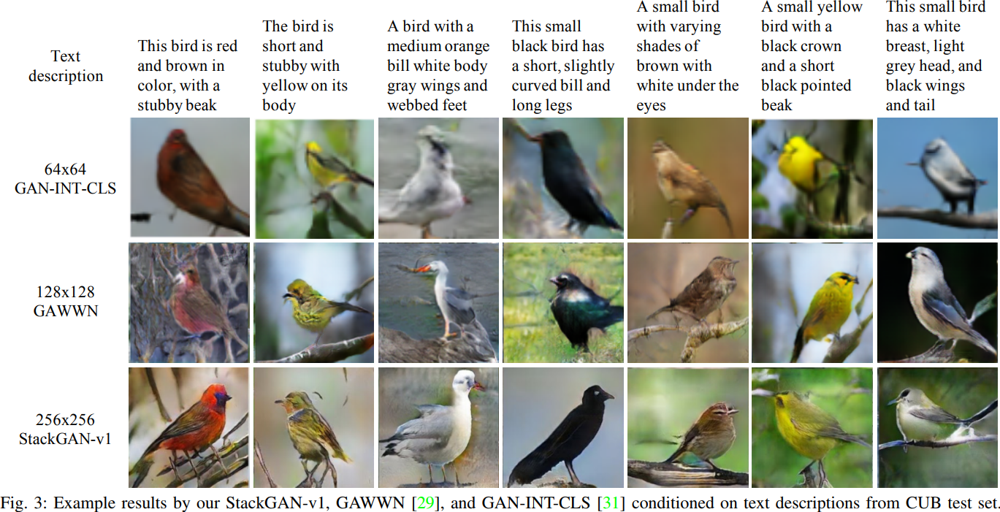]

.center[(Zhang et al, 2017)]

]

---

# Unsupervised machine translation

 

.center[

.width-100[]

.center[(Lample et al, 2018)]

]

---

class: middle

.center[

.width-100[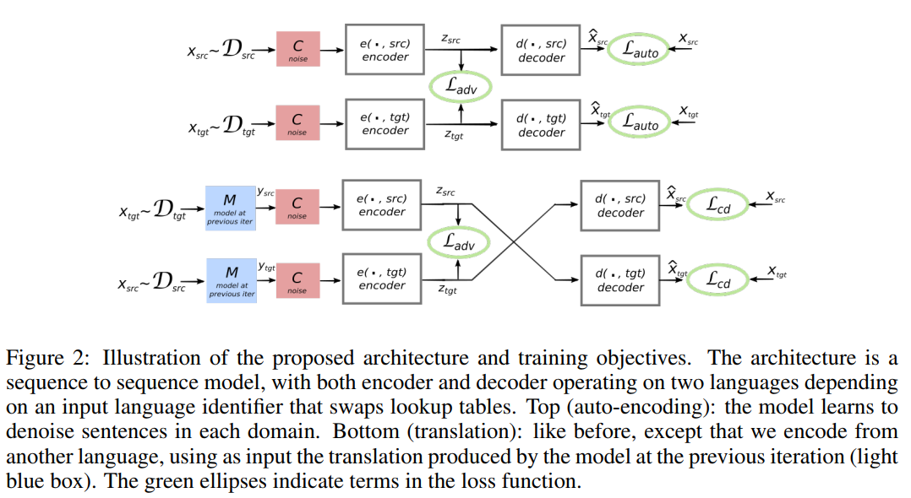]

.center[(Lample et al, 2018)]

]

---

# Brain reading

.center[

.width-100[]

.center[(Shen et al, 2018)]

]

---

class: middle

.center[

.width-100[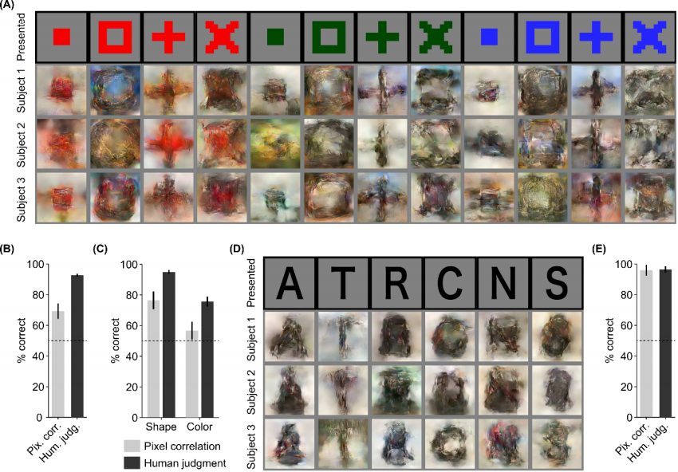]

.center[(Shen et al, 2018)]

]

---

class: middle, black-slide

.center[

<iframe width="640" height="480" src="https://www.youtube.com/embed/jsp1KaM-avU?&loop=1&start=0" frameborder="0" volume="0" allowfullscreen></iframe>

.center[(Shen et al, 2018)]

]

---

class: end-slide, center
count: false

The end.
